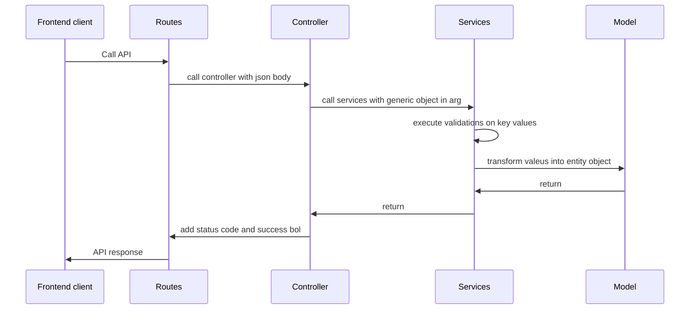

```mermaid
sequenceDiagram
    participant A as Frontend client
    A->>Routes: Call API
    Routes->>Controller: call controller with json body
    Controller ->> Services: call services with generic object in arg
    Services ->> Services: execute validations on key values
    Services ->> Model: transform valeus into entity object
    Model ->> Services: return
    Services ->> Controller: return
    Controller ->> Routes: add status code and success bol
    Routes ->> A: API response
```